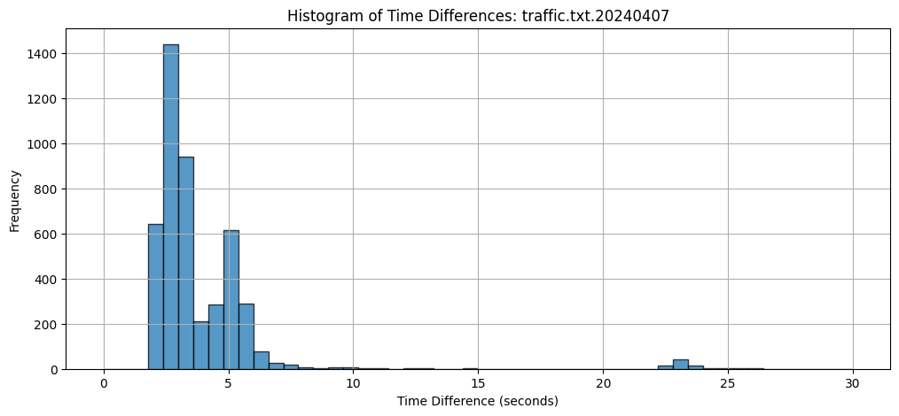

# Capstone Project: Traffic Data Analysis and Processing

## Project Title
**Traffic Data Analysis and Processing Using Python**

## Objective
Main goal of this project is to look at traffic data by working with log files. i calculate time differences and see the darection of movement. i also make pictures and charts to understand data better. i download and process images and sound files from server, and i add time on these images.

## contents 
- **Sound Analysis**:
  - i compare how loud the sound is (in dBFS) with actual sound file loudness. This is important because if they don’t match, there might be a problem with the sound. i need to check if sound files are good quality.

- **Time Calculation**:
  - i use OCR (Optical Character Recognition) to read time from images. OCR is not perfect, sometimes it makes mistakes. If OCR reads time wrong, our calculations can be wrong too. It is important to see when OCR makes mistakes so i can fix them.

- **Error Handling**:
  - i make sure to handle errors when data is not perfect. This includes catching mistakes in OCR time reading and checking if sound files are not loud enough. Fixing these errors helps us get more accurate results.

## Steps i Did

1. **Parsing Log Files**:
   - i took log files and found times of traffic events. i calculated how much time passed betien events, and i checked if the traffic was moving forward or backward. i made charts to show these movements hour by hour and looked at the average time differences.

2. **Downloading and Processing data**:
   - i downloaded images and sound files from a server using secure methods. i checked the sound files to see if they are big enough, long enough, and loud enough. i kept logs to see if downloads and checks are successful.

3. **Adding Time to Images**:
   - i filtered log entries to find those with time differences less than 10 seconds. Then, i downloaded the related images and added time stamps on them. These images with added time are saved for further study.

4. **Grouping Log Entries**:
   - i grouped log entries into 15-minute intervals and counted how many events happened in each interval. i made bar charts to show these counts, which helped us see traffic patterns over time.

5. **Making Visuals**:
   - i made different charts to show the data, like:
     - Bar charts for forward and backward movements.
     
     - Line charts for time differences.
     - Histograms for how time differences are spread out.
     - Bar charts for events in 15-minute intervals.

 Forward and Backward count of vehicles with respective to saved date-time and date-time

This is the histogram for number of time difference of vehicles passes in the particular day

It is number of entries happens in a day range for every 15 minutes which are less than 10sec

It is number of entries happens in a day range for every 15 minutes which are greater than 10sec
## Data Sources
- **Log Files**: Main data came from log files stored in darectories. These files had detailed records of traffic events.
- **Remote Server**: Extra data like images and sound files are downloaded from a remote server.

## Results and What i Found
- **Good Data Analysis**: i successfully processed log files to calculate time differences and see how traffic moved. The charts helped us understand traffic patterns.
- **Effective Media Handling**: Images and sound files are downloaded and processed correctly. Sound files are checked for quality, and time stamps are added to images for further study.
- **Flexible Setup**: The project code easily is updated and can handle new data sources or formats.

## Additional Notes
- **Tools i Used**: i used Python libraries like Pandas for data work, Matplotlib for making charts, Paramiko for downloading files securely, and PIL for working with images.
- **Secure Data Handling**: All data from the server was downloaded securely using SSH. i also had error handling in place to manage any problems with data quality or connections.
- **Keeping Records**: i kept detailed logs and documentation during the project to make sure everything was clear and could be checked later.

## Acknowledgements
- **Support**: Thanks to our project advisor and team members for their support and help, which are very important for finishing this project.

## Future Work
- **More Data**: if I could add more data sources like live traffic feeds to get a bigger picture of traffic patterns.
- **Advanced Analysis**: I could use machine learning for any work with extracted data.
- **Real-Time Processing**: I could develop the ability to analyze and show data as it comes in, for quick insights.
- **User Interface**: we could make an easy-to-use interface.

## Challenges and How i Solved Them
- **Handling Large Data**: Traffic data can be very big, so i needed efficient ways to process it.
- **Data Quality**: Sometimes data was not perfect, so i cleaned and validated it to make sure the results are accurate.
- **Remote Access**: Downloading data from remote servers securely was noteasy, but i used SSH to do it safely.

